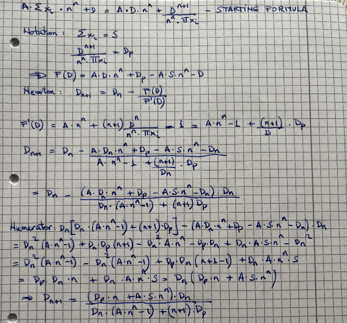
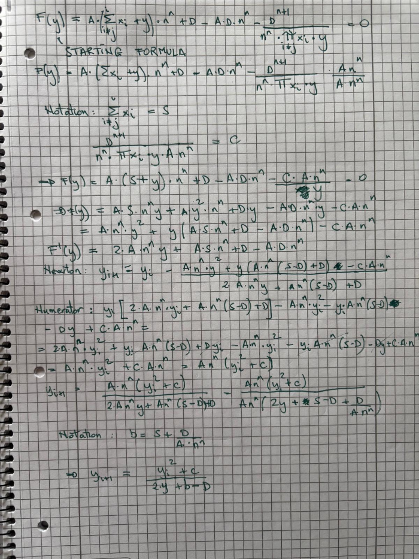

# SC StableSwap Move

A Move implementation of the StableSwap protocol, based on Curve's StableSwap algorithm. This implementation provides a way to create and manage pools of stablecoins with low slippage and efficient trading.
It can support an arbitrary number of tokens, which was a key design consideration in the implementation.
 
## Implementation Details

### Pool Creation

An LP token is created and then the pool is initialised with desired params 
```move
// 1. Create LP token
let (lp_treasury, lp_cap) = coin::create_currency<LP> (...)
```

```move
// 2. Create the pool
stableswap::create_pool(
    admin_cap,
    owner_address,
    amp,           // amplification coefficient (e.g., 100)
    fee,           // trading fee (e.g., 100 = 1%)
    admin_fee,     // admin fee (e.g., 10000 = 100% of trading fee)
    lp_treasury,
    ctx
);
```

#### Key Parameters

1. **Amplification Coefficient (A)**
   - Controls the curvature of the bonding curve
   - Higher values = more stable prices (less slippage)
   - Typical values: 100-1000
   - Example: 100 provides good stability for most stablecoin pairs

2. **Fees**
   - Trading Fee: Applied to all swaps (e.g., 100 = 1%)
   - Admin Fee: Portion of trading fee that goes to pool owner (e.g., 10000 = 100%)
   - Withdrawal Fee: Applied when removing liquidity in a single coin

#### Pool States

1. **Unlocked**
   - Initial state after creation
   - Can add coin types
   - Cannot perform swaps or add/remove liquidity

2. **Locked**
   - Normal operating state
   - Cannot add coin types
   - Can perform all operations

3. **Killed**
   - Emergency state


### Add Coin Types and Lock Pool
```move
// Add each coin type to the pool
stableswap::add_type<BTC1>(&admin_cap, &mut pool);
stableswap::add_type<BTC2>(&admin_cap, &mut pool);
stableswap::add_type<BTC3>(&admin_cap, &mut pool);
// ... repeat for all coin types

// Lock the pool to enable operations
stableswap::lock_pool(&admin_cap, &mut pool);
```
This step:
- Adds each coin type that will be used in the pool
- Must be done while pool is unlocked
- Locks the pool to enable trading and liquidity operations

### Add Liquidity

Adding liquidity to the pool is a three-step process that allows users to provide coins to the pool in exchange for LP tokens. The process ensures balanced deposits and handles fee calculations for imbalanced deposits. Each step must be completed in sequence, and all coin types must be used even if no liquidity is being added for that particular type.

#### 1. Initialize Liquidity Addition
```move
let liquidity = stableswap::init_add_liquidity(
    &mut pool,
    vector[amount1, amount2, amount3, ...],  // amounts for each coin in the pool
    min_mint_amount                         // minimum LP tokens to receive
);
```
This step:
- Calculates the expected LP tokens to mint based on the provided amounts
- Verifies the amounts are valid for the pool
- Prepares the liquidity addition process
- Returns a [hot-potato](https://move-book.com/programmability/hot-potato-pattern.html) object to be used in subsequent calls

#### 2. Add Each Coin
```move
// For each coin type in the pool
stableswap::add_liquidity<COIN_TYPE>(
    option::some(coin),  // the coin to add
    &mut liquidity,      // liquidity state from init
    &mut pool,          // the pool
    ctx                 // transaction context
);
```
This step:
- Adds each coin type one by one.
- If liquidity is not added for a certain coin type the PTB with this type still needs to be called to address potential fees
- Verifies the amount matches the expected value from initialization
- Updates pool balances and calculates fees


#### 3. Finish and Get LP Tokens
```move
let lp_coin = stableswap::finish_add_liquidity(
    liquidity,    // liquidity state from previous steps
    &mut pool,    // the pool
    ctx          // transaction context
);
```
This step:
- Mints LP tokens based on the added liquidity
- Updates the pool's LP supply
- Returns the LP tokens to the user

#### Important Notes
- All amounts must be provided in the initialization step
- The amounts must match exactly what was specified in initialization
- LP tokens are minted based on the total value added to the pool

### Exchange (Swap)

The exchange operation allows users to swap one coin for another within the pool in a single step. The process automatically calculates the output amount based on the current pool state and applies fees.

```move
// Perform the exchange
let output_coin = stableswap::exchange_coin<COIN_IN, COIN_OUT>(
    min_amount_out,  // minimum amount to receive
    input_coin,      // input coin
    &mut pool,       // the pool
    ctx             // transaction context
);
```

This operation:
- Removes the input coin from the user
- Calculates the output amount based on current pool state
- Applies trading and admin fees
- Returns the output coin to the user
- Updates pool balances

### Remove Liquidity (in all coins)

Removing liquidity from the pool is a three-step process that allows users to burn their LP tokens and receive back their proportional share of the underlying coins. The process must be completed in sequence, and all coin types must be used to receive the corresponding coins.

#### 1. Initialize Liquidity Removal
```move
// Split LP tokens for removal
let remove_lp = coin::split(&mut lp_coin, amount, ctx);

// Initialize removal process
let mut remove_liquidity = stableswap::init_remove_liquidity(remove_lp);
```
This step:
- Splits the desired amount of LP tokens for removal
- Prepares the removal process
- Calculates the expected amounts for each coin
- Returns a [hot-potato](https://move-book.com/programmability/hot-potato-pattern.html) object to be used in subsequent calls

#### 2. Remove Each Coin
```move
// Remove liquidity for each token type
let coin1 = stableswap::remove_liquidity<COIN1>(&mut remove_liquidity, &mut pool, ctx);
let coin2 = stableswap::remove_liquidity<COIN2>(&mut remove_liquidity, &mut pool, ctx);
let coin3 = stableswap::remove_liquidity<COIN3>(&mut remove_liquidity, &mut pool, ctx);
// ... repeat for all coin types
```
This step:
- Removes each coin type one by one
- Returns the proportional amount of each coin
- Updates pool balances

#### 3. Finish Removal
```move
// Complete the removal process
stableswap::finish_remove_liquidity(remove_liquidity, &mut pool, ctx);
```
This step:
- Finalizes the removal process
- Updates the pool's LP supply
- Cleans up the removal state


#### Important Notes
- All coin types must be removed in the same order as they were added
- The pool must be in the locked state to remove liquidity
- No fees are charged for proportional removal of all coins

### Remove Liquidity (Single Coin)

The remove liquidity one coin operation allows users to remove liquidity by receiving a single coin type in exchange for their LP tokens. This operation involves paying a withdrawal fee.

```move
// Remove liquidity for a single coin type
let output_coin = stableswap::remove_liquidity_one_coin<COIN_OUT>(
    min_amount_out,  // minimum amount to receive
    lp_coin,         // LP tokens to burn
    &mut pool,       // the pool
    ctx             // transaction context
);
```

This operation:
- Burns the LP tokens
- Calculates the output amount based on current pool state
- Applies withdrawal fee
- Returns the output coin to the user
- Updates pool balances

#### Important Notes
- A withdrawal fee is charged for single coin removal
- The pool must be in the locked state
- The output amount is calculated based on the current pool state and may be affected by slippage

## Mathematical Foundation

### Core Functions
The original stableswap contract has some direct calculations which have not been explained in their official repo. They have been detailed below. 

Calculate the liquidity variable D for the pool, which represents the total value in LP of all coins in the pool:



Calculate the output amount when a specific input amount is inserted into the pool:



## Testing

The implementation includes a Python script that validates calculations using an alternative method of applying Newton's method (`fsolve` from the `scipy` library).

## References

- [StableSwap Paper](https://curve.fi/files/stableswap-paper.pdf)
- [2 Token Pool Graphics](https://www.desmos.com/calculator/gpzwdnmaib)
- [Explanation Video](https://www.youtube.com/watch?v=w_zjZfkwva0)
- [Curve Contract](https://github.com/curvefi/curve-contract/blob/master/contracts/pools/3pool/StableSwap3Pool.vy)